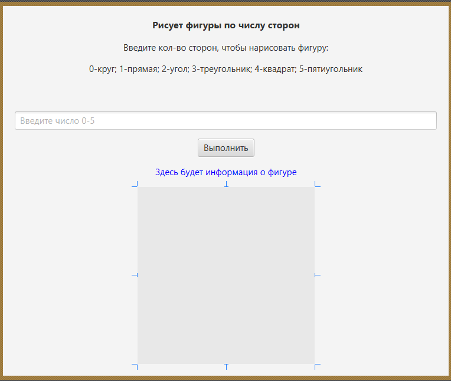
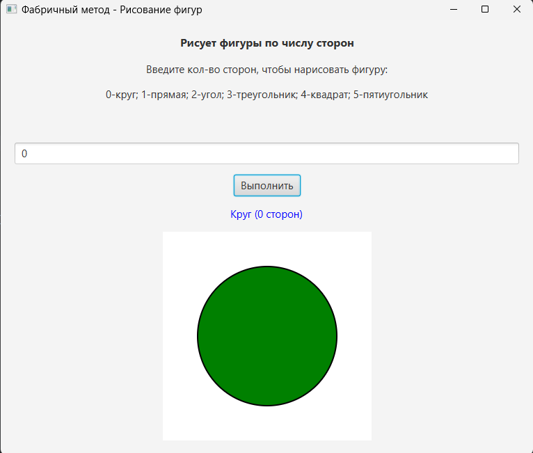
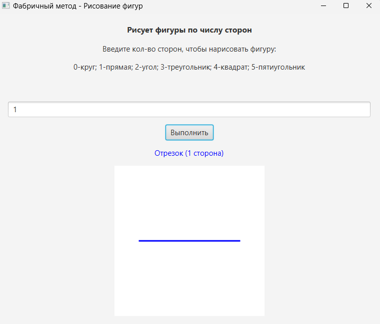
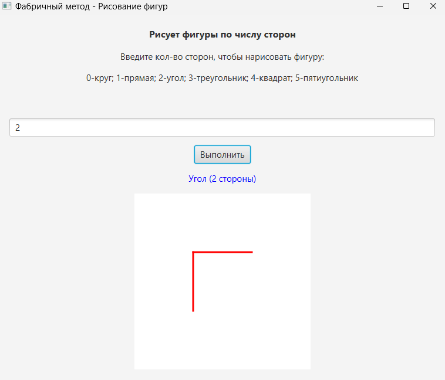
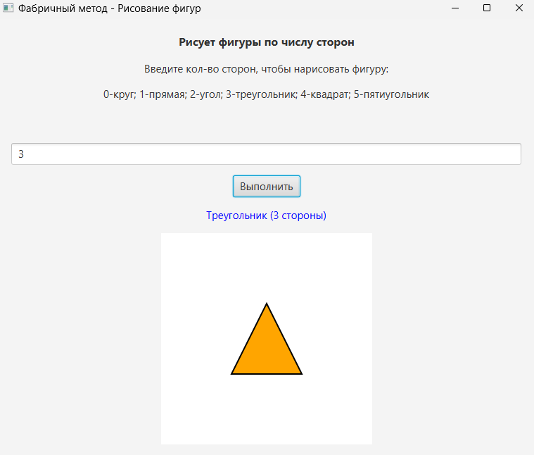
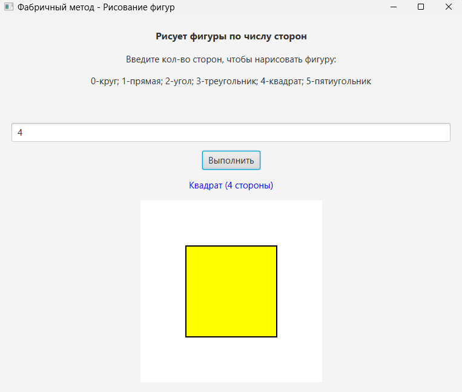
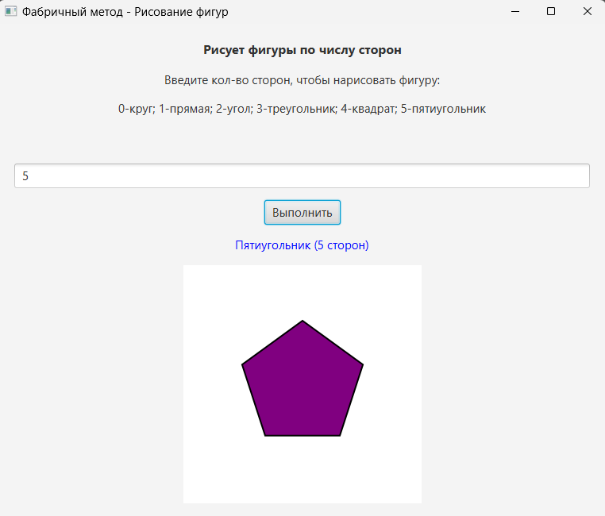

# Лабораторная работа 2 - Фабричный метод

> **Dark Edition** | Фабричный метод


Описание: Программа демонстрирует реализацию паттерна "Фабричный метод" для создания геометрических фигур. Пользователь вводит число сторон (0-5), и программа рисует соответствующую фигуру. Проект иллюстрирует принципы объектно-ориентированного программирования и порождающие паттерны проектирования.
Скриншот рабочего окна приложения

##  Архитектура - cкриншоты   

<details>
<summary><b>Скриншоты</b> (Нажми, чтобы развернуть)</summary>

| Скриншот окна в SceneBuilder |
| :---: |
|  |

| Скриншот 0 сторон | Скриншот 1 стороны |
| :---: | :---: |
|  |  |

| Скриншот 2 сторон | Скриншот 3 стороны |
| :---: | :---: |
|  |  |

| Скриншот 4 сторон | Скриншот 5 стороны |
| :---: | :---: |
|  |  |

</details>

##  Зависимости
  **Для работы программы требуются:**
  1. Java JDK 21 или выше
  2. JavaFX SDK 21.0.2 или выше
  3. IntelliJ IDEA (рекомендуется) или другая Java IDE
  4. Maven для управления зависимостями
  5. SceneBuilder для редактирования графического интерфейса

##  Установка

1.  **Клонируйте репозиторий:**
    ```bash
    git clone https://github.com/Titan0zxc/JavaFabrikMetod.git
    ```

2.  **Настройте JavaFX:**
    *   Убедитесь, что JavaFX SDK установлен и путь к нему указан в переменных окружения

3.  **Запустите решение:**
    *   Откройте проект в IntelliJ IDEA
    *   Убедитесь, что в настройках запуска указаны VM options: --module-path "путь/к/javafx-sdk/lib" --add-modules javafx.controls,javafx.fxml
    *   Запустите класс HelloApplication.java 

##  Функциональность

-  Фабричный метод - паттерн для создания объектов фигур
-  6 типов фигур - круг, отрезок, угол, треугольник, квадрат, пятиугольник
-  Графический интерфейс с Canvas для отрисовки
-  Валидация ввода - проверка корректности введенных данных
-  Графический интерфейс - интуитивно понятное управление
-  Информационная панель - вывод названия текущей фигуры

##  Технологический стек

*   Backend: Java 21, JavaFX 
*   Frontend: JavaFX FXML, SceneBuilder
*   Архитектура: Фабричный метод (порождающий паттерн)
*   Сборка: Maven
*   Проектирование: Объектно-ориентированное программирование


##  Применение
  1. Запустите приложение
  2. Введите число от 0 до 5 в текстовое поле:
       * 0 - Круг
       * 1 - Отрезок
       * 2 - Угол
       * 3 - Треугольник
       * 4 - Квадрат
       * 5 - Пятиугольник
  3. Нажмите кнопку "Выполнить"
  4. Наблюдайте результат на холсте и информацию о фигуре

##  Проверка ПО
Если программное обеспечение включает автоматизированные тесты, подробно опишите, как запускать эти тесты.

##  Проблемы
  * При первом запуске может потребоваться ручная настройка пути к JavaFX SDK
  * Предупреждение о несовпадении версий SceneBuilder и JavaFX (не критично)

Приглашение к сотрудничеству

##  Приглашение к сотрудничеству
  Предложения по развитию проекта:
    * Добавление новых типов фигур (шестиугольник, звезда, спираль)
    * Реализация изменения цвета фигур
    * Добавление анимации рисования
    * Сохранение изображения холста

##  Информация о лицензировании открытого исходного кода
  1. Проект создан в учебных целях
  2. Исходный код доступен для изучения
  3. Разрешено использование в образовательных целях

##  Документация

Полная техническая документация проекта доступна по ссылке:
- [Ссылка на документацию](([https://sites.google.com/view/study-pattern/%D0%B3%D0%BB%D0%B0%D0%B2%D0%BD%D0%B0%D1%8F/%D0%B7%D0%B0%D0%B4%D0%B0%D1%87%D0%B8/task-1-%D0%B0%D0%B1%D1%81%D1%82%D1%80%D0%B0%D0%BA%D1%82%D0%BD%D1%8B%D0%B9-%D1%81%D1%83%D0%BF%D0%B5%D1%80%D0%BA%D0%BB%D0%B0%D1%81%D1%81)](https://sites.google.com/view/study-pattern/%D0%B3%D0%BB%D0%B0%D0%B2%D0%BD%D0%B0%D1%8F/%D0%B7%D0%B0%D0%B4%D0%B0%D1%87%D0%B8/task-2-%D1%84%D0%B0%D0%B1%D1%80%D0%B8%D1%87%D0%BD%D1%8B%D0%B9-%D0%BC%D0%B5%D1%82%D0%BE%D0%B4)) - Task 2

## Источники и справочники
  1. "Паттерны объектно-ориентированного проектирования" Эрих Гамма
  2. Oracle JavaFX Documentation
  3. JavaFX Tutorials от Oracle
  4. Учебные материалы по ООП

##  Ссылки на другие проекты

* - Графический редактор фигур (Лаба 1)
*    [Wood Production Management](https://github.com/Titan0zxc/wood-production-management) - Система управления деревообрабатывающим предприятием
*    [University Schedule System](https://github.com/Titan0zxc/university-schedule-system) - Система управления расписанием вуза

---
*Этот проект был разработан в учебных целях.*
